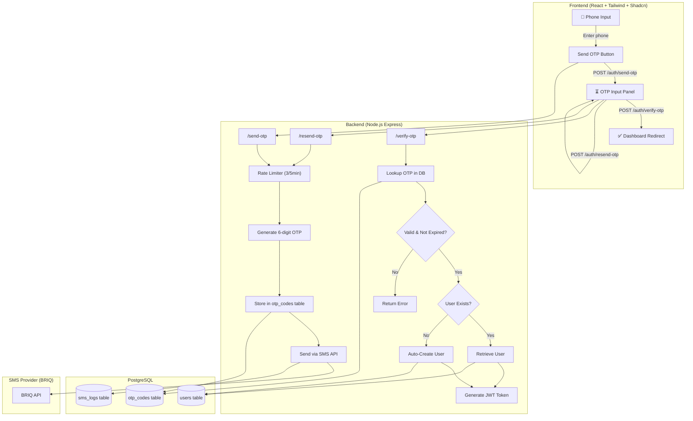
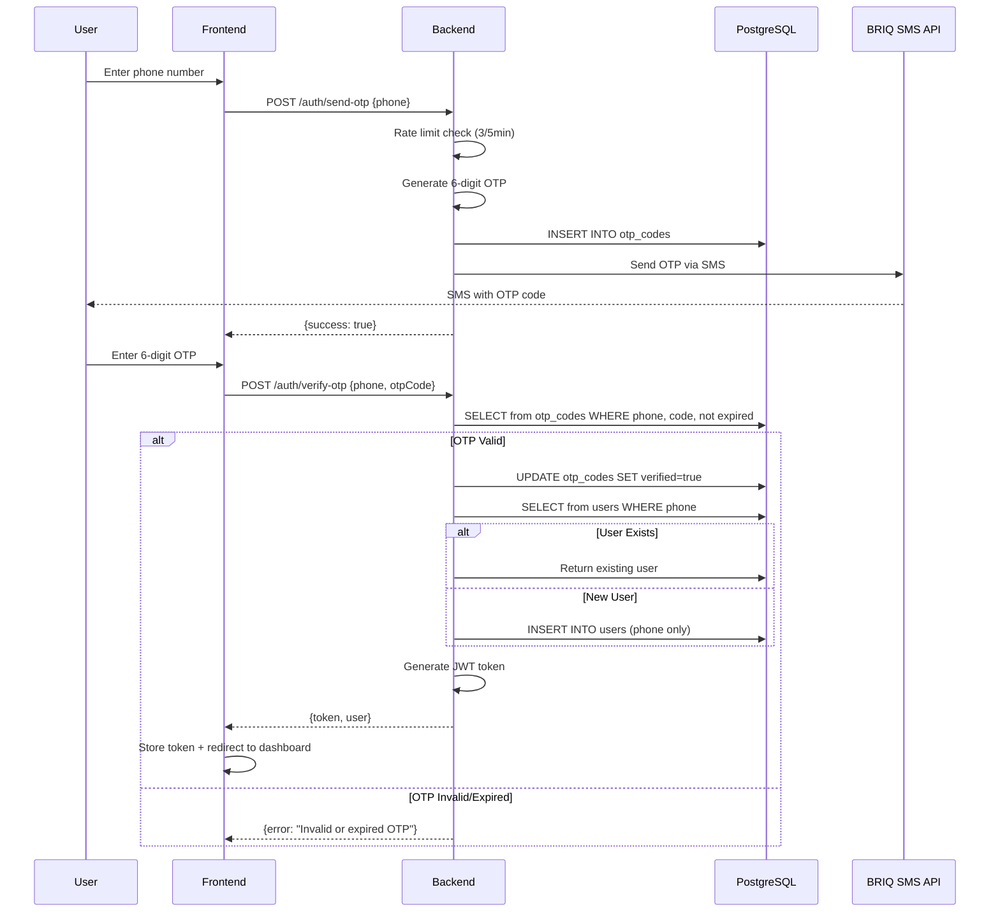

# OTP-Only Signup System — Complete Reference

This document provides the complete reference implementation for the MHEMA Express OTP-only signup system, including raw SQL, PHP Laravel implementation, architecture diagrams, SMS integration, and security considerations.

---

## Architecture Diagram



## Authentication Flow



---

## Database Schema (Raw SQL)

```sql
-- ============================================
-- OTP-Only Signup System — Database Schema
-- PostgreSQL
-- ============================================

-- Users table (phone as primary identifier)
CREATE TABLE users (
    id UUID PRIMARY KEY DEFAULT gen_random_uuid(),
    email VARCHAR(255),                          -- Optional
    password VARCHAR(255),                       -- Optional (OTP-only)
    full_name VARCHAR(255),                      -- Optional, set later via profile
    phone VARCHAR(20) UNIQUE NOT NULL,           -- Primary login identifier
    avatar_url TEXT,
    role VARCHAR(20) DEFAULT 'CUSTOMER'
        CHECK (role IN ('CUSTOMER', 'AGENT', 'ADMIN')),
    status VARCHAR(20) DEFAULT 'ACTIVE'
        CHECK (status IN ('ACTIVE', 'INACTIVE', 'SUSPENDED')),
    is_phone_verified BOOLEAN DEFAULT TRUE,
    created_at TIMESTAMPTZ DEFAULT NOW(),
    updated_at TIMESTAMPTZ DEFAULT NOW()
);

CREATE INDEX idx_users_phone ON users(phone);
CREATE INDEX idx_users_role ON users(role);

-- OTP codes table
CREATE TABLE otp_codes (
    id UUID PRIMARY KEY DEFAULT gen_random_uuid(),
    phone VARCHAR(20) NOT NULL,
    code VARCHAR(6) NOT NULL,
    expires_at TIMESTAMPTZ NOT NULL,
    verified BOOLEAN DEFAULT FALSE,
    created_at TIMESTAMPTZ DEFAULT NOW()
);

CREATE INDEX idx_otp_phone_verified ON otp_codes(phone, verified);
CREATE INDEX idx_otp_expires_at ON otp_codes(expires_at);

-- SMS logs table (audit trail)
CREATE TABLE sms_logs (
    id UUID PRIMARY KEY DEFAULT gen_random_uuid(),
    phone VARCHAR(20) NOT NULL,
    message TEXT NOT NULL,
    status VARCHAR(20) NOT NULL,  -- SENT, FAILED, PENDING, DISABLED
    provider VARCHAR(50) DEFAULT 'briq',
    error TEXT,
    created_at TIMESTAMPTZ DEFAULT NOW()
);

CREATE INDEX idx_sms_logs_phone ON sms_logs(phone);
CREATE INDEX idx_sms_logs_status ON sms_logs(status);

-- Optional: User sessions table (if not using JWT)
CREATE TABLE user_sessions (
    id UUID PRIMARY KEY DEFAULT gen_random_uuid(),
    user_id UUID NOT NULL REFERENCES users(id) ON DELETE CASCADE,
    token VARCHAR(500) NOT NULL,
    created_at TIMESTAMPTZ DEFAULT NOW(),
    expires_at TIMESTAMPTZ NOT NULL
);

CREATE INDEX idx_sessions_user ON user_sessions(user_id);
CREATE INDEX idx_sessions_token ON user_sessions(token);
```

---

## PHP Laravel Implementation

### Migration

```php
<?php
// database/migrations/xxxx_create_otp_auth_tables.php

use Illuminate\Database\Migrations\Migration;
use Illuminate\Database\Schema\Blueprint;
use Illuminate\Support\Facades\Schema;

return new class extends Migration
{
    public function up(): void
    {
        Schema::create('users', function (Blueprint $table) {
            $table->uuid('id')->primary();
            $table->string('email')->nullable();
            $table->string('password')->nullable();
            $table->string('full_name')->nullable();
            $table->string('phone', 20)->unique();
            $table->string('avatar_url')->nullable();
            $table->enum('role', ['CUSTOMER', 'AGENT', 'ADMIN'])->default('CUSTOMER');
            $table->enum('status', ['ACTIVE', 'INACTIVE', 'SUSPENDED'])->default('ACTIVE');
            $table->boolean('is_phone_verified')->default(true);
            $table->timestamps();
        });

        Schema::create('otp_codes', function (Blueprint $table) {
            $table->uuid('id')->primary();
            $table->string('phone', 20)->index();
            $table->string('code', 6);
            $table->timestamp('expires_at');
            $table->boolean('verified')->default(false);
            $table->timestamp('created_at')->useCurrent();
            $table->index(['phone', 'verified']);
        });
    }

    public function down(): void
    {
        Schema::dropIfExists('otp_codes');
        Schema::dropIfExists('users');
    }
};
```

### Models

```php
<?php
// app/Models/User.php

namespace App\Models;

use Illuminate\Database\Eloquent\Concerns\HasUuids;
use Illuminate\Foundation\Auth\User as Authenticatable;
use Laravel\Sanctum\HasApiTokens;

class User extends Authenticatable
{
    use HasUuids, HasApiTokens;

    protected $keyType = 'string';
    public $incrementing = false;

    protected $fillable = [
        'phone', 'email', 'full_name', 'role', 'status', 'is_phone_verified',
    ];

    protected $hidden = ['password'];

    public function otpCodes()
    {
        return $this->hasMany(OtpCode::class, 'phone', 'phone');
    }
}
```

```php
<?php
// app/Models/OtpCode.php

namespace App\Models;

use Illuminate\Database\Eloquent\Concerns\HasUuids;
use Illuminate\Database\Eloquent\Model;

class OtpCode extends Model
{
    use HasUuids;

    protected $keyType = 'string';
    public $incrementing = false;
    public $timestamps = false;

    protected $fillable = ['phone', 'code', 'expires_at', 'verified'];

    protected $casts = [
        'expires_at' => 'datetime',
        'verified' => 'boolean',
    ];
}
```

### Controller

```php
<?php
// app/Http/Controllers/AuthController.php

namespace App\Http\Controllers;

use App\Models\User;
use App\Models\OtpCode;
use Illuminate\Http\Request;
use Illuminate\Support\Str;
use Carbon\Carbon;

class AuthController extends Controller
{
    /**
     * POST /api/auth/send-otp
     */
    public function sendOtp(Request $request)
    {
        $request->validate(['phone' => 'required|string']);

        $phone = $this->normalizePhone($request->phone);

        // Rate limit: max 3 per 5 minutes
        $recentCount = OtpCode::where('phone', $phone)
            ->where('created_at', '>=', now()->subMinutes(5))
            ->count();

        if ($recentCount >= 3) {
            return response()->json([
                'error' => ['message' => 'Too many OTP requests. Please wait 5 minutes.']
            ], 429);
        }

        // Invalidate previous OTPs
        OtpCode::where('phone', $phone)
            ->where('verified', false)
            ->update(['verified' => true]);

        // Generate new OTP
        $code = str_pad(random_int(0, 999999), 6, '0', STR_PAD_LEFT);

        OtpCode::create([
            'phone'      => $phone,
            'code'       => $code,
            'expires_at' => now()->addMinutes(5),
        ]);

        // Send SMS (implement your SMS service here)
        // SmsService::send($phone, "Your code is: {$code}. Valid for 5 minutes.");

        return response()->json([
            'success'   => true,
            'phone'     => $phone,
            'message'   => 'OTP sent successfully',
            'expiresIn' => 300,
        ]);
    }

    /**
     * POST /api/auth/verify-otp
     */
    public function verifyOtp(Request $request)
    {
        $request->validate([
            'phone'   => 'required|string',
            'otpCode' => 'required|string|size:6',
        ]);

        $phone = $this->normalizePhone($request->phone);

        $otp = OtpCode::where('phone', $phone)
            ->where('code', $request->otpCode)
            ->where('verified', false)
            ->where('expires_at', '>', now())
            ->latest()
            ->first();

        if (!$otp) {
            return response()->json([
                'error' => ['message' => 'Invalid or expired OTP code']
            ], 400);
        }

        $otp->update(['verified' => true]);

        // Find or create user
        $user = User::firstOrCreate(
            ['phone' => $phone],
            [
                'role'              => 'CUSTOMER',
                'is_phone_verified' => true,
            ]
        );

        if ($user->status !== 'ACTIVE') {
            return response()->json([
                'error' => ['message' => 'Account is suspended']
            ], 403);
        }

        // Generate token (using Laravel Sanctum)
        $token = $user->createToken('auth_token')->plainTextToken;

        return response()->json([
            'success' => true,
            'token'   => $token,
            'user'    => [
                'id'       => $user->id,
                'fullName' => $user->full_name ?? $user->phone,
                'role'     => $user->role,
                'phone'    => $user->phone,
            ],
        ]);
    }

    /**
     * POST /api/auth/resend-otp
     */
    public function resendOtp(Request $request)
    {
        return $this->sendOtp($request);
    }

    private function normalizePhone(string $phone): string
    {
        $cleaned = preg_replace('/\D/', '', $phone);
        if (str_starts_with($cleaned, '0')) {
            $cleaned = '255' . substr($cleaned, 1);
        } elseif (strlen($cleaned) === 9) {
            $cleaned = '255' . $cleaned;
        }
        return $cleaned;
    }
}
```

### Routes

```php
<?php
// routes/api.php

use App\Http\Controllers\AuthController;

Route::prefix('auth')->group(function () {
    Route::post('/send-otp', [AuthController::class, 'sendOtp']);
    Route::post('/verify-otp', [AuthController::class, 'verifyOtp']);
    Route::post('/resend-otp', [AuthController::class, 'resendOtp']);
});
```

---

## SMS API Integration Snippet (BRIQ)

```javascript
// SMS integration using BRIQ API (Tanzania)
async function sendBriqSms(phone, message) {
    const response = await fetch('https://karibu.briq.tz/v1/message/send-instant', {
        method: 'POST',
        headers: {
            'Content-Type': 'application/json',
            'X-API-Key': process.env.SMS_API_KEY,
        },
        body: JSON.stringify({
            content: message,
            sender_id: process.env.SMS_SENDER_ID || 'MHEMA',
            recipients: [phone],  // Format: 255XXXXXXXXX
        }),
    });

    const result = await response.json();

    if (result.success || result.status === 'sent') {
        return { success: true, messageId: result.job_id };
    }
    throw new Error(result.message || 'SMS send failed');
}

// Usage:
// await sendBriqSms('255712345678', 'Your code is: 123456. Valid for 5 min.');
```

---

## Security Considerations

| Security Measure | Implementation | Status |
|---|---|---|
| **OTP Expiry** | 5-minute TTL on all OTP codes | ✅ Implemented |
| **Rate Limiting** | Max 3 OTP requests per phone per 5 min | ✅ Implemented |
| **OTP Invalidation** | Previous unused OTPs invalidated on new request | ✅ Implemented |
| **JWT Sessions** | 7-day expiry, signed with secret | ✅ Implemented |
| **Phone Normalization** | All phones normalized to `255XXXXXXXXX` | ✅ Implemented |
| **HTTPS** | Must be enabled in production (Nginx/reverse proxy) | ⚠️ Deploy Config |
| **OTP Hashing** | Optional: Hash OTP before storage with bcrypt | 🔧 Optional |
| **Brute Force** | Rate limiting + OTP expiry prevents brute force | ✅ Implemented |
| **Session Hijacking** | JWT in localStorage — consider `httpOnly` cookies for sensitive apps | 🔧 Optional |
| **SQL Injection** | Prisma ORM parameterized queries prevent injection | ✅ Implemented |
| **CORS** | Configured to allow only known frontend origins | ✅ Implemented |

### Production Checklist

1. **Enable HTTPS** — Use SSL certificate with Nginx reverse proxy
2. **Set strong `JWT_SECRET`** — Replace development secret with a 256-bit random string
3. **Verify SMS delivery** — Test with real BRIQ credentials
4. **Monitor OTP abuse** — Check `sms_logs` table for unusual patterns
5. **Consider Redis** — Swap in-memory rate limiter for Redis in multi-instance deployments
6. **OTP Hashing** — For highest security, hash OTP codes with bcrypt before storing (require user to provide plaintext for comparison)
